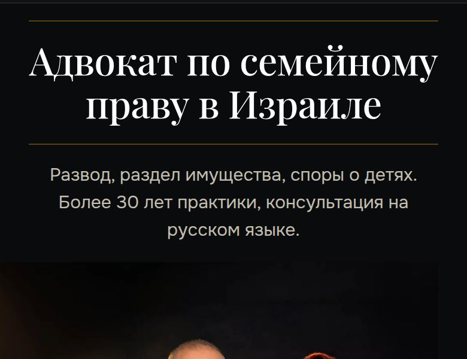
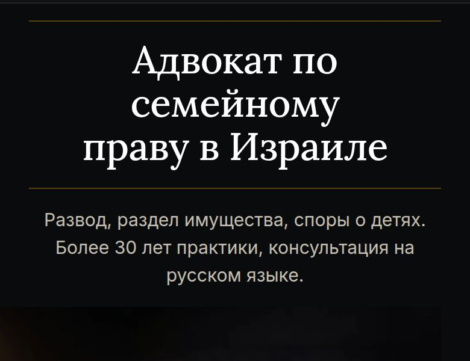
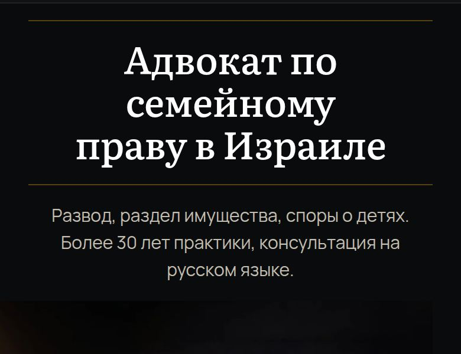
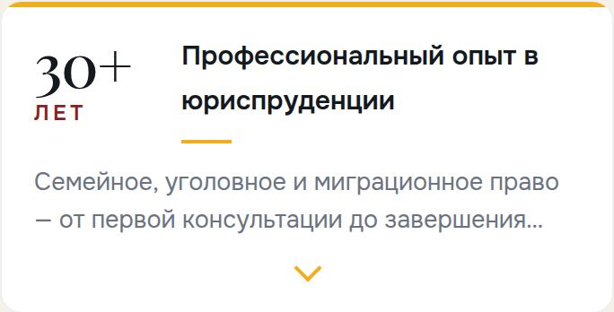
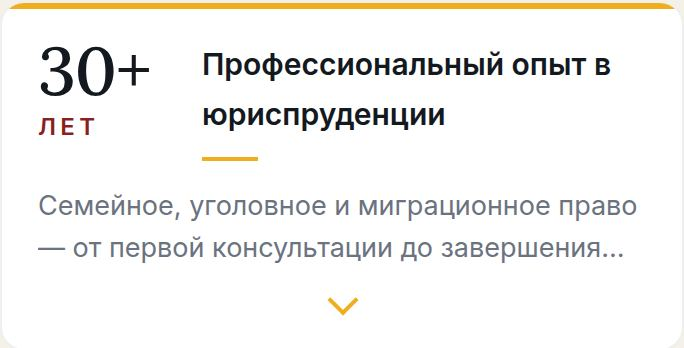
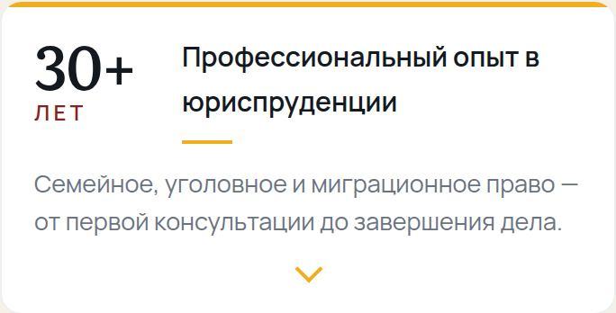
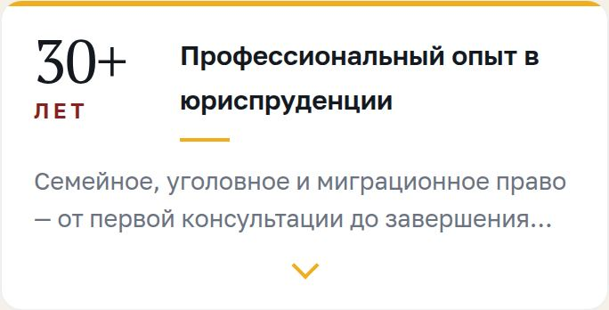
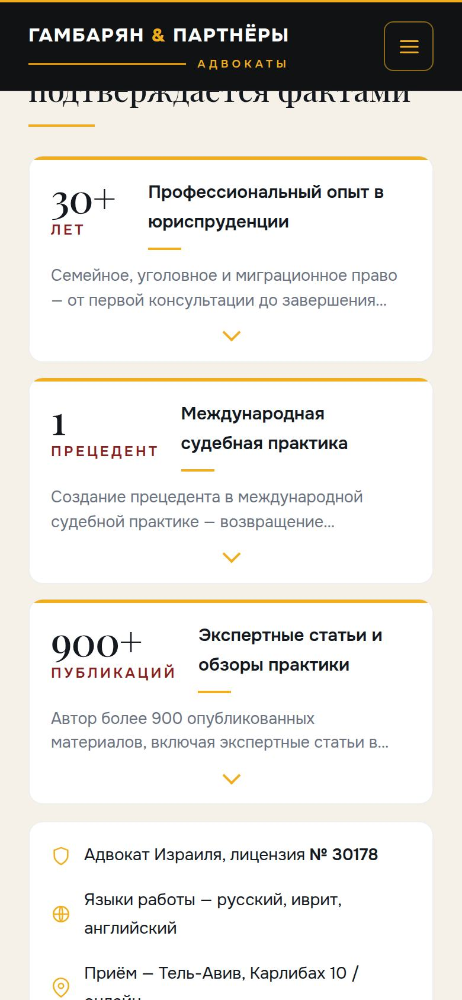

# Как выглядят версии сайта

Собрано 6 августа 2026. Пересобрано из приватного артефакта в файл: снимки
вынуты из артефакта и лежат рядом в `screenshots/`.

Ниже — настоящие снимки экрана телефона. Каждая версия отличается от текущей
ровно одним, всё остальное одинаково.

## Шрифт заголовков

Один и тот же заголовок в четырёх наборах. Смотрите на **толщину линий букв**:
чем тоньше волосяные штрихи, тем наряднее, но тем хуже читается на солнце и на
маленьком экране.

| Playfair Display — нынешний | Lora — спокойный классический |
|---|---|
|  |  |

| Literata — максимум читаемости | PT Serif — как у ALRUD и Право.ru |
|---|---|
|  |  |

## Тот же шрифт на крупной цифре

Блок «30+ лет» — самое заметное место набора на всей странице.

| Playfair Display | Lora |
|---|---|
|  |  |

| Literata | PT Serif |
|---|---|
|  |  |

## Первый экран

Что человек видит, открыв сайт с телефона, **до того как начал листать**.

| Вариант | Снимок | Что изменено |
|---|---|---|
| Сейчас на сайте |  | Кнопка под фотографией. До неё 611 пикселей прокрутки. [Открыть на телефоне](https://gambarian-landing.gambarian-landing.pages.dev/) |
| Действия выше фотографии |  | Кнопка сразу под текстом. До неё 297 пикселей — вдвое ближе. [Открыть на телефоне](https://hero-a-actions-first.gambarian-landing.pages.dev/) |
| Главное действие — звонок |  | Номер прямо в кнопке. Запись на консультацию — строкой ниже. [Открыть на телефоне](https://hero-b-call-first.gambarian-landing.pages.dev/) |
| ~~Форма прямо на первом экране~~ **снят** |  | Два поля вместо кнопки: имя и телефон. **Вариант удалён 7 августа решением владельца** (коммит `d332b14`), деплой снесён — ссылка не работает. Снимок оставлен как след решения |

## Полоса с кнопками внизу экрана

Появляется только на телефоне. Держит связь под рукой, но не мешает читать.

| Состояние | Снимок | Что происходит |
|---|---|---|
| Человек только зашёл |  | Панель внизу: позвонить, WhatsApp, записаться. [Открыть на телефоне](https://action-bar.gambarian-landing.pages.dev/) |
| Человек начал читать |  | Панель уехала вниз и освободила экран. Вернётся, когда он листает вверх. [Открыть на телефоне](https://action-bar.gambarian-landing.pages.dev/) |

## Что важно знать

- **Снимки сделаны на экране телефона 390 пикселей** — это размер обычного
  айфона. На компьютере всё выглядит крупнее, а нижняя полоса не показывается
  вовсе.
- **Каждую версию можно открыть и полистать** — ссылка рядом со снимком. Они
  живут на постоянных адресах, ссылка не поменяется.

## Связанное

- Полный список версий с описаниями и метриками — [2026-08-06-versions-links.md](2026-08-06-versions-links.md)
